# Word文档在线编辑
docx文档在线编辑

### 实现思路
1. 使用docx4j开源库提取出docx文档的公共css
2. 使用docx4j开源库把docx文档转化为html文件
3. 使用soup开源库解析html，转化为slatejs开源库支持的json格式
4. 使用slatejs展示并编辑docx转化后的json格式文件

### 服务端代码
存放于server文件下，使用springboot搭建工程，数据库使用mysql存储数据，文件服务使用mongodb,会话使用redis(可选)，Maven工程

### 前端代码
存放于client文件下，使用dva脚手架，富文本编辑使用slate

### 代码调试改错

首先需要进行后端代码调通，调通时你需要进行一些库的下载，也就是mongodb，

安装步骤：

## MongoDB 下载

MongoDB 提供了可用于 32 位和 64 位系统的预编译二进制包，你可以从MongoDB官网下载安装，MongoDB 预编译二进制包下载地址：https://www.mongodb.com/download-center/community

> 注意：在 MongoDB 2.2 版本后已经不再支持 Windows XP 系统。最新版本也已经没有了 32 位系统的安装文件。

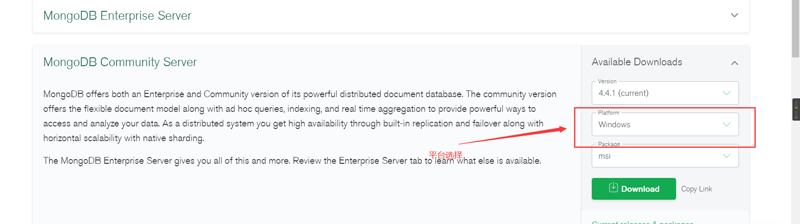

- **MongoDB for Windows 64-bit** 适合 64 位的 Windows Server 2008 R2, Windows 7 , 及最新版本的 Window 系统。

- **MongoDB for Windows 32-bit** 适合 32 位的 Window 系统及最新的 Windows Vista。 32 位系统上 MongoDB 的数据库最大为 2GB。

- **MongoDB for Windows 64-bit Legacy** 适合 64 位的 Windows Vista, Windows Server 2003, 及 Windows Server 2008 。

  下载 .msi 文件，下载后双击该文件，按操作提示安装即可。

  

  安装过程中，你可以通过点击 "Custom(自定义)" 按钮来设置你的安装目录

  

  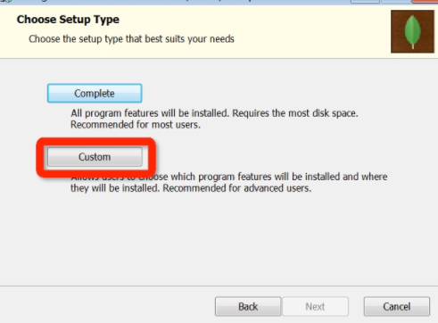

  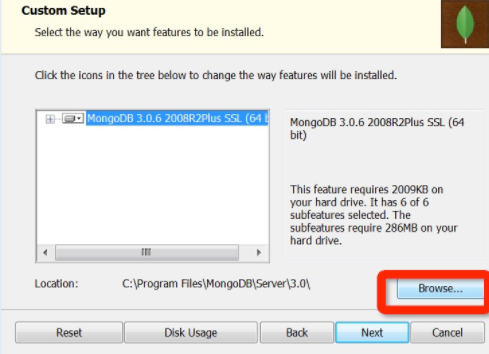

  下一步安装 **"install mongoDB compass"** 不勾选（当然你也可以选择安装它，可能需要更久的安装时间），MongoDB Compass 是一个图形界面管理工具，我们可以在后面自己到官网下载安装，下载地址：https://www.mongodb.com/download-center/compass。

  

  

  **创建数据目录**

  MongoDB将数据目录存储在 db 目录下。但是这个数据目录不会主动创建，我们在安装完成后需要创建它。请注意，数据目录应该放在根目录下（(如： C:\ 或者 D:\ 等 )。

  在本教程中，我们已经在 C 盘安装了 mongodb，现在让我们创建一个 data 的目录然后在 data 目录里创建 db 目录。

  ```
  c:\>cd c:\
  
  c:\>mkdir data
  
  c:\>cd data
  
  c:\data>mkdir db
  
  c:\data>cd db
  
  c:\data\db>
  ```

  你也可以通过 window 的资源管理器中创建这些目录，而不一定通过命令行。

  

  ------

  ## 命令行下运行 MongoDB 服务器

  为了从命令提示符下运行 MongoDB 服务器，你必须从 MongoDB 目录的 bin 目录中执行 mongod.exe 文件。

  ```
  C:\mongodb\bin\mongod --dbpath c:\data\db
  ```

  如果执行成功，会输出如下信息：

  ```
  2015-09-25T15:54:09.212+0800 I CONTROL  Hotfix KB2731284 or later update is not
  installed, will zero-out data files
  2015-09-25T15:54:09.229+0800 I JOURNAL  [initandlisten] journal dir=c:\data\db\j
  ournal
  2015-09-25T15:54:09.237+0800 I JOURNAL  [initandlisten] recover : no journal fil
  es present, no recovery needed
  2015-09-25T15:54:09.290+0800 I JOURNAL  [durability] Durability thread started
  2015-09-25T15:54:09.294+0800 I CONTROL  [initandlisten] MongoDB starting : pid=2
  488 port=27017 dbpath=c:\data\db 64-bit host=WIN-1VONBJOCE88
  2015-09-25T15:54:09.296+0800 I CONTROL  [initandlisten] targetMinOS: Windows 7/W
  indows Server 2008 R2
  2015-09-25T15:54:09.298+0800 I CONTROL  [initandlisten] db version v3.0.6
  ……
  ```

  ------

  ## 连接MongoDB

  我们可以在命令窗口中运行 mongo.exe 命令即可连接上 MongoDB，执行如下命令：

  ```
  C:\mongodb\bin\mongo.exe
  ```

  ------

  ## 配置 MongoDB 服务

  **管理员模式打开命令行窗口**

  创建目录，执行下面的语句来创建数据库和日志文件的目录

  ```
  mkdir c:\data\db
  mkdir c:\data\log
  ```

  **创建配置文件**

  创建一个配置文件。该文件必须设置 systemLog.path 参数，包括一些附加的配置选项更好。

  例如，创建一个配置文件位于 C:\mongodb\mongod.cfg，其中指定 systemLog.path 和 storage.dbPath。具体配置内容如下：

  ```
  systemLog:
      destination: file
      path: c:\data\log\mongod.log
  storage:
      dbPath: c:\data\db
  ```

  ### 安装 MongoDB服务

  通过执行mongod.exe，使用--install选项来安装服务，使用--config选项来指定之前创建的配置文件。

  ```
  C:\mongodb\bin\mongod.exe --config "C:\mongodb\mongod.cfg" --install
  ```

  要使用备用 dbpath，可以在配置文件（例如：C:\mongodb\mongod.cfg）或命令行中通过 --dbpath 选项指定。

  如果需要，您可以安装 mongod.exe 或 mongos.exe 的多个实例的服务。只需要通过使用 --serviceName 和 --serviceDisplayName 指定不同的实例名。只有当存在足够的系统资源和系统的设计需要这么做。

  启动MongoDB服务

  ```
  net start MongoDB
  ```

  关闭MongoDB服务

  ```
  net stop MongoDB
  ```

  移除 MongoDB 服务

  ```
  C:\mongodb\bin\mongod.exe --remove
  ```

  > **命令行下运行 MongoDB 服务器** 和 **配置 MongoDB 服务** 任选一个方式启动就可以。

  任选一个操作就好

  ------

  ## MongoDB 后台管理 Shell

  如果你需要进入MongoDB后台管理，你需要先打开mongodb装目录的下的bin目录，然后执行mongo.exe文件，MongoDB Shell是MongoDB自带的交互式Javascript shell,用来对MongoDB进行操作和管理的交互式环境。

  当你进入mongoDB后台后，它默认会链接到 test 文档（数据库）：

  ```
  > mongo
  MongoDB shell version: 3.0.6
  connecting to: test
  ……
  ```

  由于它是一个JavaScript shell，您可以运行一些简单的算术运算:

  ```
  > 2 + 2
  4
  >
  ```

  **db** 命令用于查看当前操作的文档（数据库）：

  ```
  > db
  test
  >
  ```

  插入一些简单的记录并查找它：

  ```
  > db.runoob.insert({x:10})
  WriteResult({ "nInserted" : 1 })
  > db.runoob.find()
  { "_id" : ObjectId("5604ff74a274a611b0c990aa"), "x" : 10 }
  >
  ```

  第一个命令将数字 10 插入到 runoob 集合的 x 字段中。

这时候我们已经安装好了我们的服务器！

然后需要开放服务器的端口号，否则我们是无法访问到这个服务器的！（有的不需要申请）

查看端口：
5：MongoDB的bin目录下输入mongo.exe/mongod.exe进入shell环境界面
6：输入命令：db.getMongo() =>结果：connection to 127.0.0.1:**27017**
use admin
7：mongoDB创建用户：db.createUser({user:"root",pwd:"root",roles:[{role:"dbAdmin",db:"admin"}]})
8：mongoDB查看当前用户权限：db.runCommand({ usersInfo:"root", showPrivileges:true })
9：mongoDB更改权限：db.grantRolesToUser("a1",[{role:"readWrite",db:"test2"}])

每个人的端口号不同，查到端口号之后需要查看是否被占用：

第一步在win10系统任务栏搜索框中输入命令，搜索到命令提示符之后，鼠标右键选择以管理员身份运行，如下图所示：

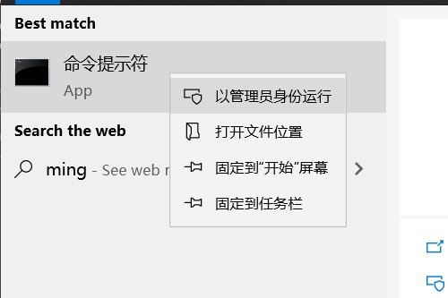

第二步进去命令提示符之后，输入netstat -ano命令并按一个回车，如下图所示：

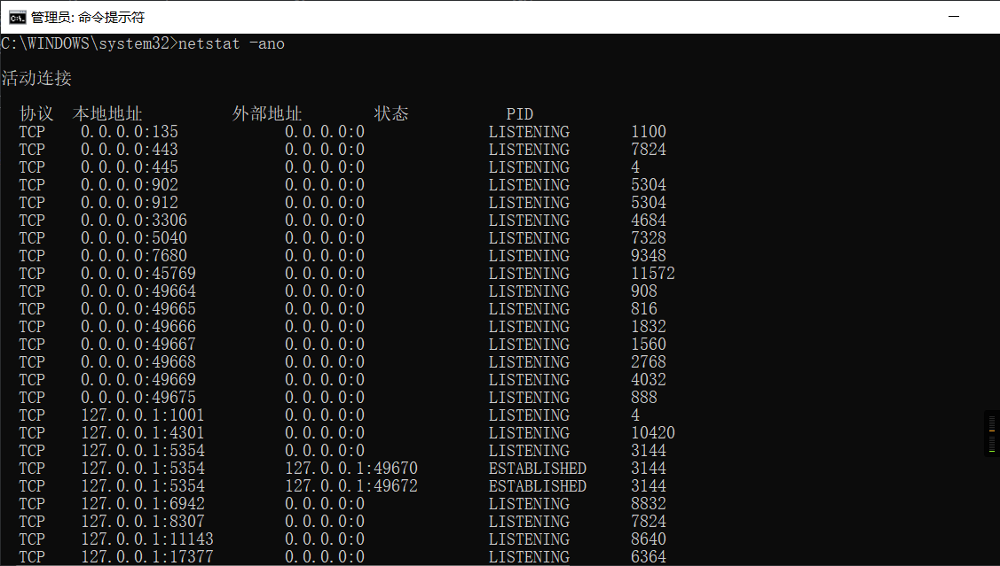

因为我们知道具体的端口号，输入netstat -aon|findstr 8080 ，其中8080加英文双引号，按回车键就可以找到占用8080端口的PID，如下图所示：

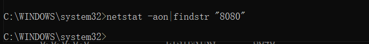我的这个没有被占用

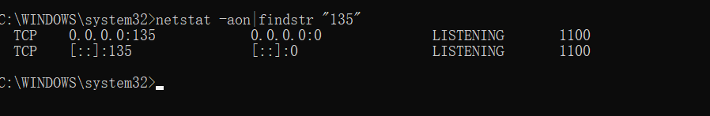这个就被占用了。

如果被占用了，此时我们就需要将这个被占用的关闭，以防我们在上面的端口被占用导致我们的项目不能运行！

第五步输入tasklist|findstr "1100"命令（这里的1100是刚才查出来的最后那个几位数字）

这里不做演示，借用别人图片一用：

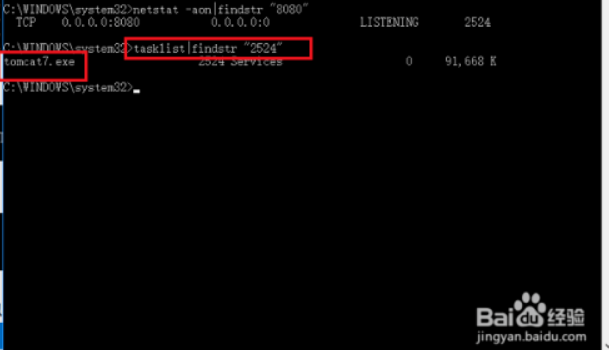

第六步找到进程的名字之后，我们打开任务管理器，点击详细信息，可以找到对应的进程，结束掉进程，端口就被释放了，如下图所示：

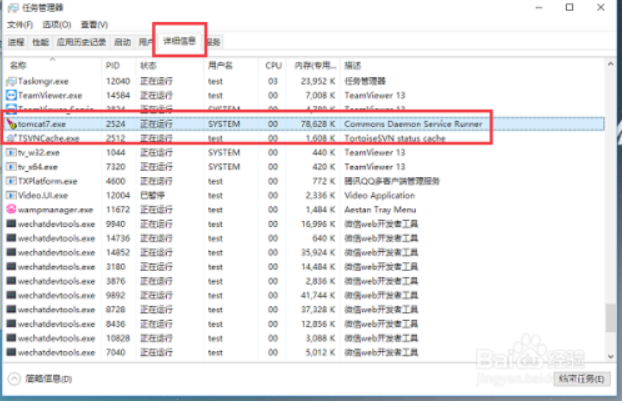

目前服务器是准备的差不多了，然后就是代码部分了，首先要看我们文件的server文件夹里面的application.properits文件

```java
spring.data.mongodb.uri=mongodb://localhost:27017/springboot-db //这个是我们服务器地址记得改成自己的端口号

database.dialect=mysql
spring.datasource.url=jdbc:mysql://localhost:3306/dbcenter?useUnicode=true&amp;characterEncoding=UTF-8&useSSL=false//这里是连接数据库的连接文件，我用的是MySQL5的版本，大家根据自己的版本号自行修改
spring.datasource.username=root//数据库的登录用户名
spring.datasource.password=123456789//登录密码
spring.datasource.driver-class-name=com.mysql.jdbc.Driver//由于我的pom不想工作了所以，我就自己下载了一个
```

然后创建一个数据库：

```mysql
/*
SQLyog Ultimate v12.5.0 (64 bit)
MySQL - 5.7.25 : Database - dbcenter
*********************************************************************
*/

/*!40101 SET NAMES utf8 */;

/*!40101 SET SQL_MODE=''*/;

/*!40014 SET @OLD_UNIQUE_CHECKS=@@UNIQUE_CHECKS, UNIQUE_CHECKS=0 */;
/*!40014 SET @OLD_FOREIGN_KEY_CHECKS=@@FOREIGN_KEY_CHECKS, FOREIGN_KEY_CHECKS=0 */;
/*!40101 SET @OLD_SQL_MODE=@@SQL_MODE, SQL_MODE='NO_AUTO_VALUE_ON_ZERO' */;
/*!40111 SET @OLD_SQL_NOTES=@@SQL_NOTES, SQL_NOTES=0 */;
CREATE DATABASE /*!32312 IF NOT EXISTS*/`dbcenter` /*!40100 DEFAULT CHARACTER SET utf8 */;

USE `dbcenter`;

/*Table structure for table `cloud_file` */

DROP TABLE IF EXISTS `cloud_file`;

CREATE TABLE `cloud_file` (
  `ID` varchar(200) DEFAULT NULL,
  `FILE_ID` varchar(200) DEFAULT NULL,
  `JSON_ID` varchar(200) DEFAULT NULL,
  `CSS_ID` varchar(200) DEFAULT NULL,
  `FILE_NAME` varchar(200) DEFAULT NULL,
  `CREATE_TIME` varchar(200) DEFAULT NULL
) ENGINE=InnoDB DEFAULT CHARSET=utf8;

/*Data for the table `cloud_file` */

insert  into `cloud_file`(`ID`,`FILE_ID`,`JSON_ID`,`CSS_ID`,`FILE_NAME`,`CREATE_TIME`) values 
('4542f682996b4cb1909fc6bb5ac7ecda','5f90d4630ccc7a17c0b2fdeb','5f90d46a0ccc7a17c0b2fded','5f90d46a0ccc7a17c0b2fdef','GYB创业培训所需资料及报名表.docx','2020-10-22 08:37:55.0');

/*!40101 SET SQL_MODE=@OLD_SQL_MODE */;
/*!40014 SET FOREIGN_KEY_CHECKS=@OLD_FOREIGN_KEY_CHECKS */;
/*!40014 SET UNIQUE_CHECKS=@OLD_UNIQUE_CHECKS */;
/*!40111 SET SQL_NOTES=@OLD_SQL_NOTES */;

```

忘记放文件了，大家自行创建一个txt文档，然后复制进去，把后缀改成.sql，然后导入即可。

此时我们便可以运行整个项目了！如果启动运行有错，大家可以留言错误，看到后会第一时间回复！


找到这个端口号；

## 调试前段部分

我把前段代码也放入了整个项目里面，client便是前段的代码集合，按照如下路径找到相应得到文件：

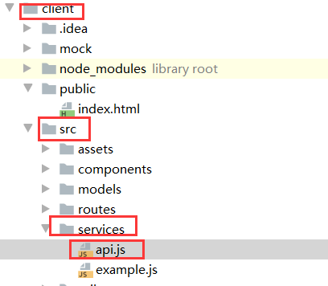

```java
import { stringify } from 'qs';
import request,{download,downloadJson} from '../utils/request';
const urlfs = 'http://localhost:9909/' //需要改这里，之前让大家记住的端口号，在这里进行相关的修改即可。
const url = ''
export {
  url
}
......
```


然后改完这个之后，需要进行一些文件的安装，

首先是node.js的安装，官网地址：https://nodejs.org/en/download/ （链接：https://pan.baidu.com/s/1Vstya-3fA6NZbyeHBLe5Ew 提取码：92gy 这里提供一个64位的安装包，32位链接：https://pan.baidu.com/s/1kU3sQ5PHo4-r1ldXpQoLAA 提取码：p8rg ）。

我这里选的是.msi文件，这种比压缩包方便点，不用配置环境变量。

步骤1：首先双击运行

步骤 2 : 点击以上的Run(运行)，将出现如下界面：


步骤 3 : 勾选接受协议选项，点击 next（下一步） 按钮 :


步骤 4 : Node.js默认安装目录为 "C:\Program Files\nodejs\" , 你可以修改目录，并点击 next（下一步）：


步骤 5 : 点击树形图标来选择你需要的安装模式 , 然后点击下一步 next（下一步）


步骤 6 :点击 Install（安装） 开始安装Node.js。你也可以点击 Back（返回）来修改先前的配置。 然后并点击 next（下一步）：


安装过程：


点击 Finish（完成）按钮退出安装向导。


检测PATH环境变量是否配置了Node.js，点击开始=》运行=》输入"cmd" => 输入命令"path"，输出如下结果：

```
PATH=C:\oraclexe\app\oracle\product\10.2.0\server\bin;C:\Windows\system32;
C:\Windows;C:\Windows\System32\Wbem;C:\Windows\System32\WindowsPowerShell\v1.0\;
c:\python32\python;C:\MinGW\bin;C:\Program Files\GTK2-Runtime\lib;
C:\Program Files\MySQL\MySQL Server 5.5\bin;C:\Program Files\nodejs\;
C:\Users\rg\AppData\Roaming\npm
```

我们可以看到环境变量中已经包含了C:\Program Files\nodejs\

检查Node.js版本


下面是npm的安装教程，来自菜鸟教程的哟：（原网址：https://www.runoob.com/nodejs/nodejs-npm.html）

# NPM 使用介绍

NPM是随同NodeJS一起安装的包管理工具，能解决NodeJS代码部署上的很多问题，常见的使用场景有以下几种：

- 允许用户从NPM服务器下载别人编写的第三方包到本地使用。
- 允许用户从NPM服务器下载并安装别人编写的命令行程序到本地使用。
- 允许用户将自己编写的包或命令行程序上传到NPM服务器供别人使用。

由于新版的nodejs已经集成了npm，所以之前npm也一并安装好了。同样可以通过输入 **"npm -v"** 来测试是否成功安装。命令如下，出现版本提示表示安装成功:

```
$ npm -v
2.3.0
```

如果你安装的是旧版本的 npm，可以很容易得通过 npm 命令来升级，命令如下：

```
$ sudo npm install npm -g
/usr/local/bin/npm -> /usr/local/lib/node_modules/npm/bin/npm-cli.js
npm@2.14.2 /usr/local/lib/node_modules/npm
```

如果是 Window 系统使用以下命令即可：

```
npm install npm -g
```

> 使用淘宝镜像的命令：
>
> ```
> npm install -g cnpm --registry=https://registry.npm.taobao.org
> ```

------

## 使用 npm 命令安装模块

npm 安装 Node.js 模块语法格式如下：

```
$ npm install <Module Name>
```

以下实例，我们使用 npm 命令安装常用的 Node.js web框架模块 **express**:

```
$ npm install express
```

安装好之后，express 包就放在了工程目录下的 node_modules 目录中，因此在代码中只需要通过 **require('express')** 的方式就好，无需指定第三方包路径。

```
var express = require('express');
```

------

## 全局安装与本地安装

npm 的包安装分为本地安装（local）、全局安装（global）两种，从敲的命令行来看，差别只是有没有-g而已，比如

```
npm install express          # 本地安装
npm install express -g   # 全局安装
```

如果出现以下错误：

```
npm err! Error: connect ECONNREFUSED 127.0.0.1:8087 
```

解决办法为：

```
$ npm config set proxy null
```

### 本地安装

- \1. 将安装包放在 ./node_modules 下（运行 npm 命令时所在的目录），如果没有 node_modules 目录，会在当前执行 npm 命令的目录下生成 node_modules 目录。
- \2. 可以通过 require() 来引入本地安装的包。

### 全局安装

- \1. 将安装包放在 /usr/local 下或者你 node 的安装目录。
- \2. 可以直接在命令行里使用。

如果你希望具备两者功能，则需要在两个地方安装它或使用 **npm link**。

接下来我们使用全局方式安装 express

```
$ npm install express -g
```

安装过程输出如下内容，第一行输出了模块的版本号及安装位置。

```
express@4.13.3 node_modules/express
├── escape-html@1.0.2
├── range-parser@1.0.2
├── merge-descriptors@1.0.0
├── array-flatten@1.1.1
├── cookie@0.1.3
├── utils-merge@1.0.0
├── parseurl@1.3.0
├── cookie-signature@1.0.6
├── methods@1.1.1
├── fresh@0.3.0
├── vary@1.0.1
├── path-to-regexp@0.1.7
├── content-type@1.0.1
├── etag@1.7.0
├── serve-static@1.10.0
├── content-disposition@0.5.0
├── depd@1.0.1
├── qs@4.0.0
├── finalhandler@0.4.0 (unpipe@1.0.0)
├── on-finished@2.3.0 (ee-first@1.1.1)
├── proxy-addr@1.0.8 (forwarded@0.1.0, ipaddr.js@1.0.1)
├── debug@2.2.0 (ms@0.7.1)
├── type-is@1.6.8 (media-typer@0.3.0, mime-types@2.1.6)
├── accepts@1.2.12 (negotiator@0.5.3, mime-types@2.1.6)
└── send@0.13.0 (destroy@1.0.3, statuses@1.2.1, ms@0.7.1, mime@1.3.4, http-errors@1.3.1)
```

### 查看安装信息

你可以使用以下命令来查看所有全局安装的模块：

```
$ npm list -g

├─┬ cnpm@4.3.2
│ ├── auto-correct@1.0.0
│ ├── bagpipe@0.3.5
│ ├── colors@1.1.2
│ ├─┬ commander@2.9.0
│ │ └── graceful-readlink@1.0.1
│ ├─┬ cross-spawn@0.2.9
│ │ └── lru-cache@2.7.3
……
```

如果要查看某个模块的版本号，可以使用命令如下：

```
$ npm list grunt

projectName@projectVersion /path/to/project/folder
└── grunt@0.4.1
```

------

## 使用 package.json

package.json 位于模块的目录下，用于定义包的属性。接下来让我们来看下 express 包的 package.json 文件，位于 node_modules/express/package.json 内容：

```
{
  "name": "express",
  "description": "Fast, unopinionated, minimalist web framework",
  "version": "4.13.3",
  "author": {
    "name": "TJ Holowaychuk",
    "email": "tj@vision-media.ca"
  },
  "contributors": [
    {
      "name": "Aaron Heckmann",
      "email": "aaron.heckmann+github@gmail.com"
    },
    {
      "name": "Ciaran Jessup",
      "email": "ciaranj@gmail.com"
    },
    {
      "name": "Douglas Christopher Wilson",
      "email": "doug@somethingdoug.com"
    },
    {
      "name": "Guillermo Rauch",
      "email": "rauchg@gmail.com"
    },
    {
      "name": "Jonathan Ong",
      "email": "me@jongleberry.com"
    },
    {
      "name": "Roman Shtylman",
      "email": "shtylman+expressjs@gmail.com"
    },
    {
      "name": "Young Jae Sim",
      "email": "hanul@hanul.me"
    }
  ],
  "license": "MIT",
  "repository": {
    "type": "git",
    "url": "git+https://github.com/strongloop/express.git"
  },
  "homepage": "http://expressjs.com/",
  "keywords": [
    "express",
    "framework",
    "sinatra",
    "web",
    "rest",
    "restful",
    "router",
    "app",
    "api"
  ],
  "dependencies": {
    "accepts": "~1.2.12",
    "array-flatten": "1.1.1",
    "content-disposition": "0.5.0",
    "content-type": "~1.0.1",
    "cookie": "0.1.3",
    "cookie-signature": "1.0.6",
    "debug": "~2.2.0",
    "depd": "~1.0.1",
    "escape-html": "1.0.2",
    "etag": "~1.7.0",
    "finalhandler": "0.4.0",
    "fresh": "0.3.0",
    "merge-descriptors": "1.0.0",
    "methods": "~1.1.1",
    "on-finished": "~2.3.0",
    "parseurl": "~1.3.0",
    "path-to-regexp": "0.1.7",
    "proxy-addr": "~1.0.8",
    "qs": "4.0.0",
    "range-parser": "~1.0.2",
    "send": "0.13.0",
    "serve-static": "~1.10.0",
    "type-is": "~1.6.6",
    "utils-merge": "1.0.0",
    "vary": "~1.0.1"
  },
  "devDependencies": {
    "after": "0.8.1",
    "ejs": "2.3.3",
    "istanbul": "0.3.17",
    "marked": "0.3.5",
    "mocha": "2.2.5",
    "should": "7.0.2",
    "supertest": "1.0.1",
    "body-parser": "~1.13.3",
    "connect-redis": "~2.4.1",
    "cookie-parser": "~1.3.5",
    "cookie-session": "~1.2.0",
    "express-session": "~1.11.3",
    "jade": "~1.11.0",
    "method-override": "~2.3.5",
    "morgan": "~1.6.1",
    "multiparty": "~4.1.2",
    "vhost": "~3.0.1"
  },
  "engines": {
    "node": ">= 0.10.0"
  },
  "files": [
    "LICENSE",
    "History.md",
    "Readme.md",
    "index.js",
    "lib/"
  ],
  "scripts": {
    "test": "mocha --require test/support/env --reporter spec --bail --check-leaks test/ test/acceptance/",
    "test-ci": "istanbul cover node_modules/mocha/bin/_mocha --report lcovonly -- --require test/support/env --reporter spec --check-leaks test/ test/acceptance/",
    "test-cov": "istanbul cover node_modules/mocha/bin/_mocha -- --require test/support/env --reporter dot --check-leaks test/ test/acceptance/",
    "test-tap": "mocha --require test/support/env --reporter tap --check-leaks test/ test/acceptance/"
  },
  "gitHead": "ef7ad681b245fba023843ce94f6bcb8e275bbb8e",
  "bugs": {
    "url": "https://github.com/strongloop/express/issues"
  },
  "_id": "express@4.13.3",
  "_shasum": "ddb2f1fb4502bf33598d2b032b037960ca6c80a3",
  "_from": "express@*",
  "_npmVersion": "1.4.28",
  "_npmUser": {
    "name": "dougwilson",
    "email": "doug@somethingdoug.com"
  },
  "maintainers": [
    {
      "name": "tjholowaychuk",
      "email": "tj@vision-media.ca"
    },
    {
      "name": "jongleberry",
      "email": "jonathanrichardong@gmail.com"
    },
    {
      "name": "dougwilson",
      "email": "doug@somethingdoug.com"
    },
    {
      "name": "rfeng",
      "email": "enjoyjava@gmail.com"
    },
    {
      "name": "aredridel",
      "email": "aredridel@dinhe.net"
    },
    {
      "name": "strongloop",
      "email": "callback@strongloop.com"
    },
    {
      "name": "defunctzombie",
      "email": "shtylman@gmail.com"
    }
  ],
  "dist": {
    "shasum": "ddb2f1fb4502bf33598d2b032b037960ca6c80a3",
    "tarball": "http://registry.npmjs.org/express/-/express-4.13.3.tgz"
  },
  "directories": {},
  "_resolved": "https://registry.npmjs.org/express/-/express-4.13.3.tgz",
  "readme": "ERROR: No README data found!"
}
```

### Package.json 属性说明

- **name** - 包名。
- **version** - 包的版本号。
- **description** - 包的描述。
- **homepage** - 包的官网 url 。
- **author** - 包的作者姓名。
- **contributors** - 包的其他贡献者姓名。
- **dependencies** - 依赖包列表。如果依赖包没有安装，npm 会自动将依赖包安装在 node_module 目录下。
- **repository** - 包代码存放的地方的类型，可以是 git 或 svn，git 可在 Github 上。
- **main** - main 字段指定了程序的主入口文件，require('moduleName') 就会加载这个文件。这个字段的默认值是模块根目录下面的 index.js。
- **keywords** - 关键字

------

## 卸载模块

我们可以使用以下命令来卸载 Node.js 模块。

```
$ npm uninstall express
```


卸载后，你可以到 /node_modules/ 目录下查看包是否还存在，或者使用以下命令查看：

```
$ npm ls
```

------

## 更新模块

我们可以使用以下命令更新模块：

```
$ npm update express
```

------

## 搜索模块

使用以下来搜索模块：

```
$ npm search express
```

------

## 创建模块

创建模块，package.json 文件是必不可少的。我们可以使用 NPM 生成 package.json 文件，生成的文件包含了基本的结果。

```
$ npm init
This utility will walk you through creating a package.json file.
It only covers the most common items, and tries to guess sensible defaults.

See `npm help json` for definitive documentation on these fields
and exactly what they do.

Use `npm install <pkg> --save` afterwards to install a package and
save it as a dependency in the package.json file.

Press ^C at any time to quit.
name: (node_modules) runoob                   # 模块名
version: (1.0.0) 
description: Node.js 测试模块(www.runoob.com)  # 描述
entry point: (index.js) 
test command: make test
git repository: https://github.com/runoob/runoob.git  # Github 地址
keywords: 
author: 
license: (ISC) 
About to write to ……/node_modules/package.json:      # 生成地址

{
  "name": "runoob",
  "version": "1.0.0",
  "description": "Node.js 测试模块(www.runoob.com)",
  ……
}


Is this ok? (yes) yes
```

以上的信息，你需要根据你自己的情况输入。在最后输入 "yes" 后会生成 package.json 文件。

接下来我们可以使用以下命令在 npm 资源库中注册用户（使用邮箱注册）：

```
$ npm adduser
Username: mcmohd
Password:
Email: (this IS public) mcmohd@gmail.com
```

接下来我们就用以下命令来发布模块：

```
$ npm publish
```

如果你以上的步骤都操作正确，你就可以跟其他模块一样使用 npm 来安装。

------

## 版本号

使用NPM下载和发布代码时都会接触到版本号。NPM使用语义版本号来管理代码，这里简单介绍一下。

语义版本号分为X.Y.Z三位，分别代表主版本号、次版本号和补丁版本号。当代码变更时，版本号按以下原则更新。

- 如果只是修复bug，需要更新Z位。
- 如果是新增了功能，但是向下兼容，需要更新Y位。
- 如果有大变动，向下不兼容，需要更新X位。

版本号有了这个保证后，在申明第三方包依赖时，除了可依赖于一个固定版本号外，还可依赖于某个范围的版本号。例如"argv": "0.0.x"表示依赖于0.0.x系列的最新版argv。

NPM支持的所有版本号范围指定方式可以查看[官方文档](https://npmjs.org/doc/files/package.json.html#dependencies)。

------

## NPM 常用命令

除了本章介绍的部分外，NPM还提供了很多功能，package.json里也有很多其它有用的字段。

除了可以在[npmjs.org/doc/](https://npmjs.org/doc/)查看官方文档外，这里再介绍一些NPM常用命令。

NPM提供了很多命令，例如install和publish，使用npm help可查看所有命令。

- NPM提供了很多命令，例如`install`和`publish`，使用`npm help`可查看所有命令。
- 使用`npm help <command>`可查看某条命令的详细帮助，例如`npm help install`。
- 在`package.json`所在目录下使用`npm install . -g`可先在本地安装当前命令行程序，可用于发布前的本地测试。
- 使用`npm update <package>`可以把当前目录下`node_modules`子目录里边的对应模块更新至最新版本。
- 使用`npm update <package> -g`可以把全局安装的对应命令行程序更新至最新版。
- 使用`npm cache clear`可以清空NPM本地缓存，用于对付使用相同版本号发布新版本代码的人。
- 使用`npm unpublish <package>@<version>`可以撤销发布自己发布过的某个版本代码。

------

## 使用淘宝 NPM 镜像

大家都知道国内直接使用 npm 的官方镜像是非常慢的，这里推荐使用淘宝 NPM 镜像。

淘宝 NPM 镜像是一个完整 npmjs.org 镜像，你可以用此代替官方版本(只读)，同步频率目前为 10分钟 一次以保证尽量与官方服务同步。

你可以使用淘宝定制的 cnpm (gzip 压缩支持) 命令行工具代替默认的 npm:

```
$ npm install -g cnpm --registry=https://registry.npm.taobao.org
```

这样就可以使用 cnpm 命令来安装模块了：

```
$ cnpm install [name]
```

更多信息可以查阅：http://npm.taobao.org/。


如果在运行期间有错也请大家进行留言！


好的开始运行前段了！

首先启动命令提示符，也就是黑框框！

移动到我们的项目的路径：以我的为例子！

E:\360MoveData\Users\10938\Desktop\server\server\client 路径找到client为止；

因为我的操作系统为win10，移动命令可能不同，大家自行修改！

移动盘：

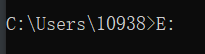

移动到工作目录：

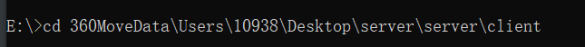

使用npm启动项目：

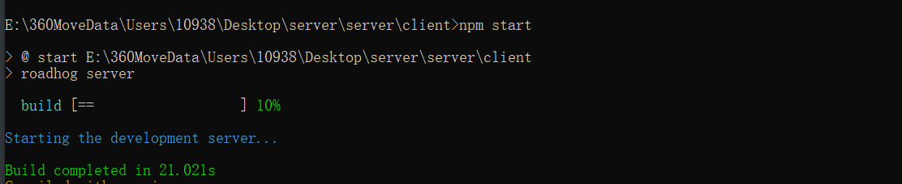

第一次启动会慢点，等待即可，启动好以后，会使用默认浏览器打开：

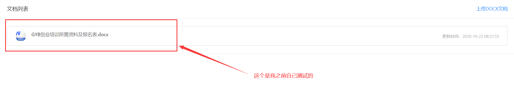

此时还不能运行，需要大家在E盘创建一个文件夹，用来存放临时文件，路径如下：E:\test

里面有两个文件：document.docx和document.docx.html

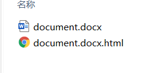

如果你没有E盘怎么版，如果有文件重复怎么办等，这个好办，方法如下：

修改文件路径即可，也就是修改如图的文件：

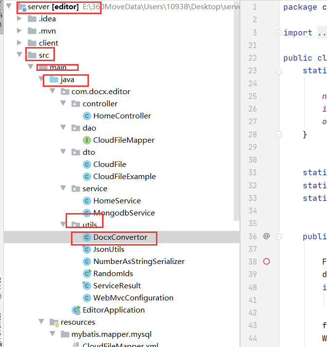


```java
public class DocxConvertor {
    static {

        nestLists = true;
        inputFilePath = "E:\\test\\document.docx";
        outFilePath = "E:\\test\\document.docx.html";
    }
```

修改这个inputFilePath和outFilePath即可！


目前这就是我想到的注意点了，如果有新的发现会继续更新，如果大家有新的问题可以提出留言，初始代码也是github上的一个大佬的，但是文件缺少太多，解析不详细，所以我重新写了一下，并且添加了缺少的文件，如有冒犯请见谅。

email：1093869292@qq.com&zhang19990906@gmail.com
